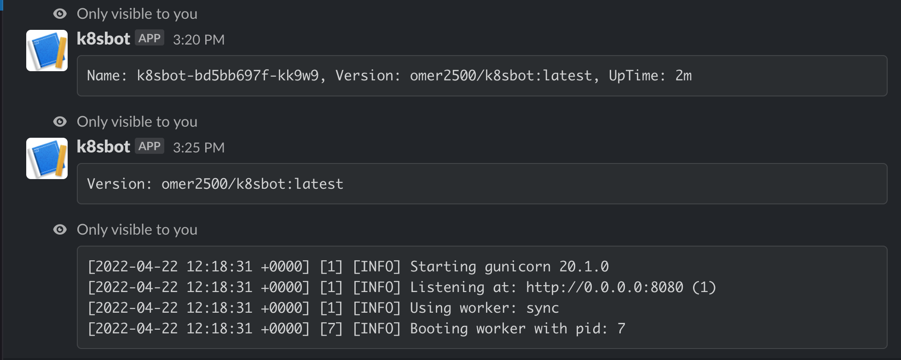

# k8sbot

k8sbot is a bot that allow you to get information about your pods inside your cluster from slack.

## Table of Contents

- [Requirements](#Requirements)
- [Usage](#usage)
- [Support](#support)
- [Contributing](#contributing)

## Requirements

- python(3.8 and above)[https://www.python.org]
- minikube (for local development)

## Usage

In order to run the bot you should follow these steps:

- Clone the repo
- Create a slack bot app using the slack-bot-manifest.yaml file (file is optional)
- Get the secrets you need you need in order to run the bot server and add them to the secret.yaml file inside k8s folder
- Get a running k8s cluster
- build the docker image of the bot-server
- push the docker image to registry (optional)
- Apply all the files that are in the k8s folder

Feel free to remove any sections that aren't applicable to your project.

## Local Development

### Env Variables

### Env Variables

| variable                        | type    | description                                                                    | default          |
|---------------------------------|---------|--------------------------------------------------------------------------------|------------------|
| SLACK_SIGN_TOKEN                        | string  | Sign token of the slackbot service                                                       | -                |

## Bot commands
In slack you can run these commands to use the bot

```
/getpods namespace

List pods by namespace 

/version pod name
List version of a pod

/getlogs pod namespace tail
List logs of pod by tail
```

example of each command by order:



## Local Development

For local development of the code itself run:

```
python3 -m venv ./venv && ./venv/soruce/bin/activate
```

then install requirements:
```
pip3 install -r requirements.txt
```
If you are using vscode you can just start debug session on bot.py file

## Local Development with docker 
create a minikube cluster and expose it from you machine with ngrok

## Adding new commands

in order to add new command:

code:

- add route and service function
- inject the route to the app via init_routes function

slack:

- go to the commands page and add the new route you added


